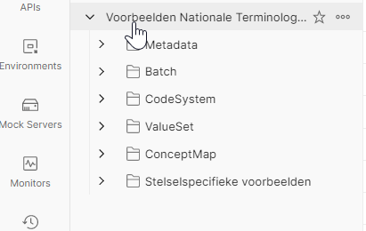
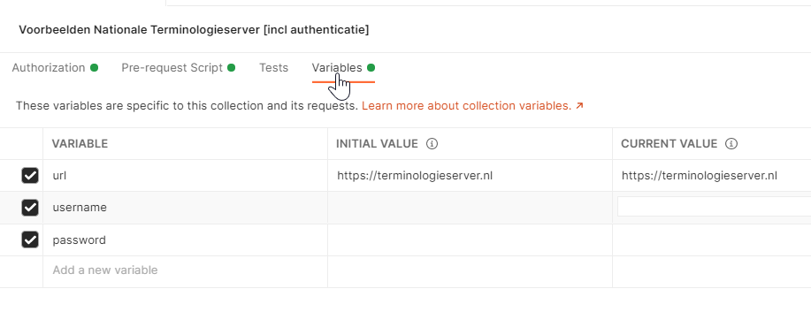
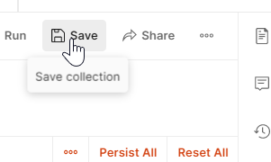
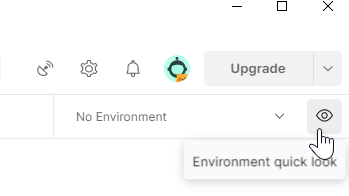
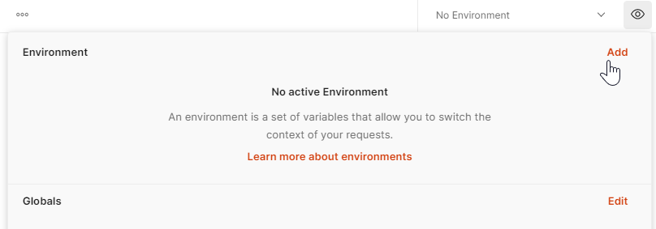
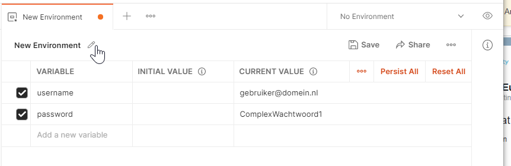
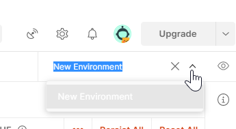

# postman
Voorbeelden voor het gebruik van de FHIR API, gedocumenteerd als een Postman collectie. Importeer het JSON bestand in deze map in postman, en creëer een *environment* met variabelen *username* en *password*.

## Toevoegen gebruikersnaam en wachtwoord
Er zijn twee manieren om de gebruikersnaam en het wachtwoord toe te voegen aan de collection.
- Collection variabelen
- Environment variabelen

De __collection__ zoals die in deze repository te downloadn is, bevat een __prerequest script__ dat de gebruikersnaam en wachtwoord uit variabelen ophaalt. Hierbij geldt dat er eerst wordt gekeken naar variabelen in de __collection__, en indien deze leeg of afwezig zijn, wordt gezocht in de __environment__. Hier onder volgt voor beide manieren een uitleg.

Wanneer je meerdere collections wilt aanmaken met verschillende requests, kan het nuttig zijn om de inloggegevens op environment-niveau te definiëren. Zo zijn deze gegevens altijd gelijk voor alle collections. Wanneer je slechts 1 collection hebt voor de Nationale Terminologieserver, is het veiliger om de inloggegevens aan de collection te hangen, zodat deze niet per ongeluk in een andere collection gebruikt kunnen worden.

### Variabelen in __collection__ toevoegen
- Klik in de linker balk op de _collectie_ __Voorbeelden Nationale Terminologieserver [incl authenticatie]__. Hiermee open je de instellingen van de _collectie_.

    

- Klik op de tab __Variables__. Vul vervolgens je gebruikersnaam en wachtwoord in bij de juiste rij. Let op dat je de gebruikersnaam en het wachtwoord invult in de kolom __current value__, anders worden deze niet actief. Klik als laatste op __Save__ om de wijzigingen op te slaan.
    
    
    
    

### Variabelen in __environment__ toevoegen
- Klik op het icoon in de volgende screenshot

    
- Klik op __Add__

    
- Creëer 2 variabelen: __username__ en __password__. Je kan de environment ook een naam geven via het potloodje naast '_New Environment_'. Let op dat je de gebruikersnaam en het wachtwoord invult in de kolom __current value__, anders zijn deze niet effectief. Klik als laatste op __Save__ om de wijzigingen op te slaan.

    
- Activeer de juiste environment via het dropdown menu rechts boven in het scherm.

    

- Door met de muis op het oogje in deze screenshot te klikken verschijnen de actieve environment variabelen. Deze zouden overeen moeten komen met de zojuist ingevulde gegevens.

    

# Toevoegen nieuwe _requests_
Het is mogelijk om zelf nieuwe requests toe te voegen aan de __collection__. Zolang de request in de map __Voorbeelden Nationale Terminologieserver [incl authenticatie]__ valt, wordt de authenticatie automatisch afgehandeld.