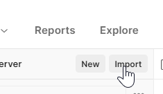

# postman
Examples for using the FHIR API, documented as a Postman collection. Import the JSON file in this map in Postman and create an *environment* with the variables *username* and *password*.

## Import
Importing the JSON file can be done by clicking on the button at the top of the left column.  

   
   
The collection with examples will appear in the left column as __Voorbeelden Nationale Terminologieserver [incl authenticatie]__.

## Adding username and password
There are two ways to add the username and password to the collection:
- Collection variables
- Environment variables

The __collection__ as downloadable in this repository contains a __prerequest script__ that retrieves the username and password from the variables. For this, it first checks for the variables in the __collection__, and if these are empty or not present it will search in the __environment__. Below you will find an explanation for both methods.

If you wish to create multiple collections with different requests it could be useful to define the login details on the environment level. This way your login details will be the same for all collections. If you only have one collection for the National Terminology Server then defining the login details on this collection level will be more secure. That way it will not be accidentally used in other collections.

### Adding variables to the __collection__ level
- In the left bar click on _collectie_ __Voorbeelden Nationale Terminologieserver [incl authenticatie]__. This will open the settings of the _collection_.

    

- Click on the tab __Variables__. Enter your username and password in the correct row. Please ensure that you enter your username and password in the column __current value__, or they will not become active. Finally, click on __Save__ to save your changes.
    
    
    
    

### Adding variables to the __environment__ level
- Click on the eye-icon, as displayed in the following screenshot

    
- Click on __Add__

    
- Create two variables: __username__ and __password__. You can also name the environment by clicking on the pencil icon next to '_New Environment_'. Please ensure that you enter your username and password in the column __current value__, or they will not become active. Finally, click on __Save__ to save your changes.

    
- Activate the correct environment by selecting it in the dropdown menu in the top right of the screen.

    

- By clicking on the eye icon, as visible in the screenshot, the active environment variables will be displayed. These should match your recently entered login details. 

    

# Adding new _requests_
It is possible to add new requests to the __collection__ yourself. As long as the request falls under the folder __Voorbeelden Nationale Terminologieserver [incl authenticatie]__ the authentication will occur automatically.

